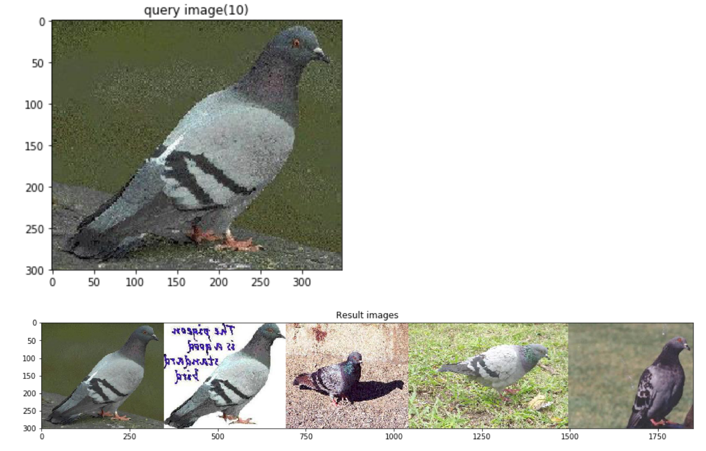

# Feature Extraction and Reverse Image Search on Caltech-101 Dataset
This notebook will guide you through the process of analyzing an image dataset using a pre-trained convolution network (VGG16) and extracting feature vectors for each image

Post analysis we try to demonstrate 'reverse image search' one of the widely popular applications of image analysis.

# Flow:
* Download [VGG16 pre-trained model](https://keras.io/applications/#vgg16) using keras

* Perform Feature Extraction :
  >Here we remove the last layer ie.,the softmax classification layer so our output model now has only 12 layers and the last layer would be fc2(Dense) a fully connected layer
  
* Get feature vectors for all the images then scale them down using [PCA](https://scikit-learn.org/stable/modules/generated/sklearn.decomposition.PCA.html)

* Use cosine distance between pca features to compare the query image to 5 number of closest images and return them as thumbnails

# Watch the Video:
[](https://youtu.be/FpWsLvXFCy0)


# Steps:

# Deploy on IBM Cloud:


* Sign up for IBM's [Watson Studio](https://dataplatform.cloud.ibm.com/). By creating a project in Watson Studio a free tier ``Object Storage`` service will be created in your IBM Cloud account. Take note of your service names as you will need to select them in the following steps.

> Note: When creating your Object Storage service, select the ``Free`` storage type in order to avoid having to pay an upgrade fee.

* Create a new Project in Watson Studio (New --> Standard project)
[](https://www.youtube.com/watch?v=unyZ8SAhuPQ)
* Create an new Notebook (Add to project --> Notebook --> from url) 
[](https://www.youtube.com/watch?v=r6GOhFYW3t4)
* Create an Environment (Environment --> New Environment -->)
[](https://www.youtube.com/watch?v=2ZhkXhhKhmI)
* Provision the notebook on newly created Environment
[](https://www.youtube.com/watch?v=V3mPYws12wY)
* Run the project

[](https://www.youtube.com/watch?v=UJouMcQog1E/)
* Stop the Environment Post usage


# Run Locally:
* Clone the repository

```
git clone https://github.com/rapchic/Reverse-Image-Search.git
```

* Navigate into the directory

```
cd Reverse-Image-Search-master
```

* Run using Jupyter notebooks

```
jupyter notebook
```

# Sample Output:


<!-- keep this -->
## License

This code pattern is licensed under the Apache License, Version 2. Separate third-party code objects invoked within this code pattern are licensed by their respective providers pursuant to their own separate licenses. Contributions are subject to the [Developer Certificate of Origin, Version 1.1](https://developercertificate.org/) and the [Apache License, Version 2](https://www.apache.org/licenses/LICENSE-2.0.txt).

[Apache License FAQ](https://www.apache.org/foundation/license-faq.html#WhatDoesItMEAN)


